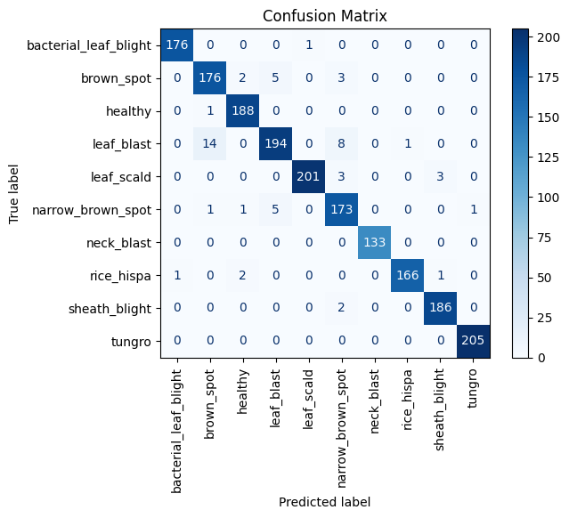

# rice_disease_cnn

## Project Overview
This project aims to develop a Convolutional Neural Network (CNN) model for the detection of rice diseases using image classification techniques. The model will help in early detection and prevention of diseases in rice crops, thereby improving crop yield and reducing agricultural losses.

Architectured two CNN models to perform rice disease classification ultimately deepening my understanding of CNN, working with image data and Neural Networks in general.

### Project Limitations
The idea by itself is not that scalable since you'd have to identify rice leaves from others and then only perform classification on those plus the dataset it is trained upon encompasses individual diseased leaf pictures to clarify more accurately in other words rice fields being green in general becomes an obstacle/noise data when making predictions hence it is advised to upload the individual leaf images for better accuracy.

## Table of Contents

- [Overview](#project-overview)
- [Requirements](#Requirements)
- [Project Configuration](#project-configuration)
- [Models](#models)
- [Website](#website)
- [Performance Considerations](#performance-considerations)
- [Dataset](#dataset)
- [References](#references)

## Requirements
### Used Libraries:
- TensorFlow
- OpenCV (cv2)
- NumPy
- Pandas
- Flask
- SQLite3

### Training Environment:
The model was trained in a cloud environment, specifically using Kaggle, with the help of a GPU T4x2 accelerator. However, if you have powerful enough hardware, you can perform the training locally too. It's advisable to have an RTX 3000 series graphics card for efficient local training.

## Project Configuration

### Directory Structure:
- `main/`: Main folder containing the project files.
  - `website/`: Subfolder for the website.
    - `model/`: Holds trained model files (.h5) and prediction code.
      - [Model 1 Prediction Code](website/model/model1_prediction.py) (Add link to Model 1 prediction code)
      - [Model 2 Prediction Code](website/model/model2_prediction.py) (Add link to Model 2 prediction code)
    - `static/`: Contains static files required for the website (e.g., images).
    - `templates/`: Holds HTML templates for web pages.
    - `app.py`: Flask application file.
    - `config.py`: Configuration file ensuring specified image types for predictions.
    - `help.py`: Helper functions used in the website.
    - `login.db`: SQLite database for login features.
    - `sql.py`: Code for connecting to the database and executing queries.
  - `traininglog.ipynb`: Jupyter Notebook file showcasing the code used for training the models.

### Trained Model Files:
- The trained model files (.h5) should be located in the `website/model/` folder. However, these files are not included in the repository(for obvious reasons). You can obtain them by training the model by refererring the notebook files I will include in this(or link the kaggle notebook) or make a request to me and I'll host it somewhere for it to be downloaded.

### Web Pages:
- The website's HTML templates are located in the `website/templates/` folder.

## Models

### Trained Model Files:
- The trained model files (.h5) are essential for making predictions on rice disease images. However, these files are not included in the repository due to their size. You can obtain them by training the model for which I will provide the code or kaggle link.

### Model Differences:
- **Model 1 (Lightweight Model):**
  - Trained on a relatively small dataset encompassing up to 4 different classes.
  - Designed for faster inference and suitable for resource-constrained environments.

- **Model 2 (Transfer Learning Model):**
  - Trained on a large dataset of about 16,000 images across 10 different classes.
  - Utilizes transfer learning on ImageNet under DenseNet architecture.
  - Offers higher accuracy and robustness, especially for a broader range of rice disease classes.

### Confusion Matrix:

### Model training files:
- For the lightweight model unfortunately I accidentally deleted the file so it's lost.
- For the other one here: [training log](website/training_log_03.ipynb)

## Website

- User interface for uploading rice plant images.
- Integration with trained models for disease prediction.
- User authentication and login features.
- Responsive design for cross-device compatibility.
- A run down on how it works could be understood by looking at the [Directory Structure](#directory-structure)

## Performance Considerations

- For the larger model developed using transfer learning,rather than loading the entire model directly from the .h5 file, the architecture needs to be defined again, and only the weights are loaded from the file.
- Due to this approach, the initialization process may take longer, potentially impacting the prediction time when using the transfer learning model.

idk where I went wrong but I didn't have the time to debug and train the entire model again so I just went with it since it ultimately worked.

## Dataset

### Kaggle Dataset Link:
- Here's the Kaggle dataset link for the larger model: [Rice Leaf Diseases Detection Dataset](https://www.kaggle.com/datasets/loki4514/rice-leaf-diseases-detection?select=Rice_Leaf_Diease) Dataset under Rice_Leaf_Disease folder was used.
- The light weight model's dataset encompasses only 4 classes while the other one has 10.
  
## References

- Inspired from [Rice Leaf Transfer Learning](https://www.kaggle.com/code/loki4514/rice-leaf-transfer-learning-99-accuracy)
